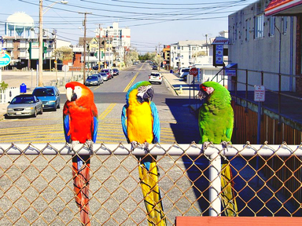

> Developed with [Giuseppe Marino](https://github.com/giuseppe16180)

## Hold and modify

The [HAM6](https://en.wikipedia.org/wiki/Hold-And-Modify) method allows to store images with 2^12 colors by using only 6 bits per pixel (instead of 12) and a palette with 16 colors, 12 bits each.

When displaying a pixel, the first 2 bits are used to determine what to do with the remaining 4 bits:
- `00` means that the other 4 bits should be used to access the palette
- `01` means that the green and blue channel are the same as the previous pixel, while the red channel is interpreted as true color from the remaining four bits
- `10` and `01` act just like the last one, changing the green and the blue channel respectively

The method only describes how to display the image, it doesn't take care of its creation.

### Usage

This implementation simulates this behaviour by limiting the colors that can be used, but doesn't output a 6 bpp image.
For each pixel, each of the four methods is executed (`00`, `01`, `10` and `11`). Whichever gives the smaller error is chosen, in a greedy way.

```matlab
h = ham6(img);
figure; imshow(h);
```

 <br> RGB |  <br> HAM6
:----:|:----:
